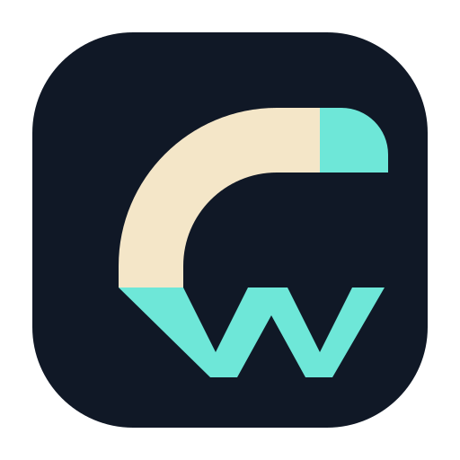
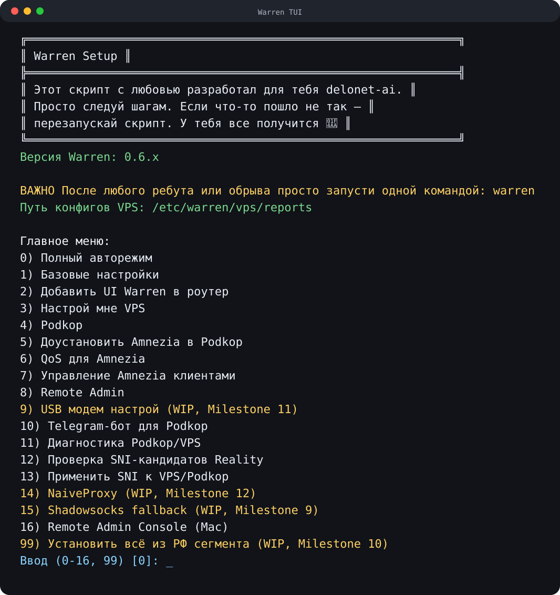
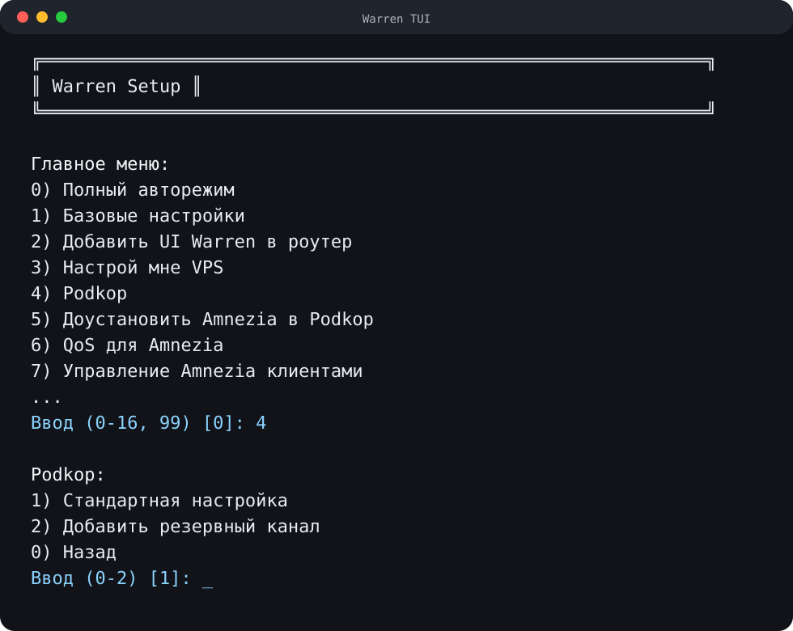
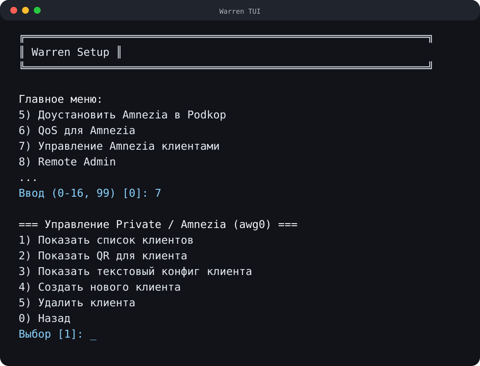

# Warren



`Warren` — установщик и помощник для роутеров на OpenWrt, в первую очередь для NanoPi R5S/R5C.

Проект нужен, чтобы с минимальным количеством ручных действий подготовить роутер, настроить Podkop, подключить VPS с `VLESS + Reality`, поднять приватный доступ через `AmneziaWG` и дальше управлять этим из одного понятного меню.

Основной сценарий: пользователь заходит по SSH на роутер, запускает одну команду и дальше выбирает нужные действия в Warren.

## Для кого

Warren ориентирован на пользователей, которые не хотят вручную собирать настройку из десятков инструкций и каждый раз вспоминать команды OpenWrt, firewall, UCI, Podkop, AmneziaWG и VPS-панели.

Цель проекта — оставить сложность внутри скриптов, а пользователю дать предсказуемый поток:

1. Подключиться к OpenWrt по SSH.
2. Запустить Warren.
3. Пройти базовую настройку, Podkop, VPS и приватный доступ через меню.

## Что уже есть

Текущий Warren умеет:

- проверять OpenWrt, интернет, время и базовую среду;
- устанавливать базовые пакеты;
- расширять `overlay` через `expand-root`;
- устанавливать и настраивать Podkop;
- готовить VPS под `VLESS + Reality`;
- проверять и применять SNI-кандидаты для Reality;
- устанавливать и настраивать `AmneziaWG` на OpenWrt;
- создавать, показывать, удалять и диагностировать клиентов AmneziaWG;
- применять QoS-профили для AmneziaWG-клиентов;
- ставить Telegram-бота для быстрых правок Podkop;
- запускать диагностику Podkop/VPS;
- поднимать Remote Admin для доступа к роутеру через VPS без публичного IP на роутере;
- работать с OpenWrt `24.10.x` через `opkg` и с OpenWrt `25.12.x` через `apk`.

## Как запустить

```sh
wget -O /tmp/warren.sh "https://raw.githubusercontent.com/delonet-ai/Warren/main/warren.sh" && sh /tmp/warren.sh
```

## Скриншоты TUI

Главное меню Warren:



Подменю Podkop:



Управление AmneziaWG-клиентами:



## Основные режимы

В меню Warren развиваются такие направления:

- `Автоматический режим` — полный сценарий настройки роутера, Podkop, VPS и связанных компонентов.
- `Basic setup` — базовая подготовка OpenWrt.
- `Настрой мне VPS` — установка и настройка VPS под `3x-ui`, `VLESS + Reality` и Warren-отчёты.
- `Podkop` — установка и настройка Podkop.
- `Доустановить Amnezia в Podkop` — добавление приватного доступа через AmneziaWG.
- `QoS для Amnezia` — профили трафика для AmneziaWG-клиентов.
- `Управление Amnezia клиентами` — создание, список, config/QR и удаление клиентов.
- `Telegram-бот для Podkop` — быстрые правки списков, endpoints и клиентов через Telegram.
- `Диагностика Podkop/VPS` — проверка DNS, маршрутов, Podkop, `sing-box`/`xray`, VPS и сетевой связности.
- `Проверка SNI-кандидатов Reality` — безопасная проверка SNI на VPS без изменения конфигов до подтверждения.
- `Remote Admin` — удалённый доступ к OpenWrt через VPS и reverse tunnel.

## Дорожная карта

Ближайшие задачи:

- стабилизировать live regression для AmneziaWG, QoS, diagnostics, SNI checker и LuCI parity;
- довести Remote Admin до устойчивого fresh install flow для чистого OpenWrt и чистого VPS;
- оформить отдельный Self SNI-сценарий;
- добавить fallback-сценарий на Shadowsocks;
- подготовить установку Warren из локального или РФ-доступного bundle;
- добавить сценарии USB-модема как основного или резервного uplink;
- добавить NaiveProxy как отдельный proxy-сценарий;
- закрепить мониторинг через `luci-app-nlbwmon` и `luci-app-statistics`;
- продолжить политику версий для критичных компонентов: Podkop installer, `3x-ui`, AmneziaWG packages, Warren bundle и Remote Admin protocol.

Подробная техническая документация, политика зависимостей, внутренние сценарии и milestones разработки находятся в [TECHNICAL_README.md](TECHNICAL_README.md).
